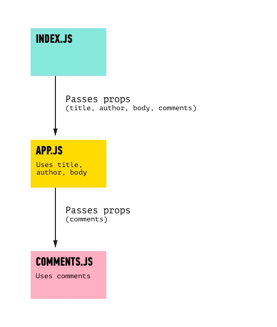

### Nested Components

**Question: What problems would you encounter when trying to add multiple comments to your post?**

It would be a pain to have to explicitly define every comment when rendering `<Post />`, especially if each comment had multiple properties.

This problem is a telltale sign that our separation of concerns is being stretched, and it's time to break things into a new component.

To solve it, we can "nest" `Comment` components within a `Post` component.

* We create these comments the same way we did with posts: define a `Post` class that `extends Component` and has a `render` method.

* Next, we'll put comments inside an individual post component. To do this, we can reference a comment using `<Comment />` inside of `Post`'s `render` method.

Starting from the blog post code, let's create a new file for a `Comment` component, `src/Comment.js`:

```jsx
import React, {Component} from 'react'

class Comment extends Component {
  render () {
    return (
      <div>
        <p>{this.props.body}</p>
      </div>
    )
  }
}

export default Comment
```

This looks pretty standard - we've defined our component class, which inherits from `React.Component`. We're exporting this `Comment` class by default for anything importing this file. Lastly, the JSX we're returning is a paragraph displaying a `body` prop (which will be passed in).

Now, in `src/App.js`, we need to import our `Comment` component so it's available to the `Post` component class. Change the top of `App.js` to include the new class:

```js
import React, { Component } from 'react'
import './App.css'
// Load in Comment component
import Comment from './Comment.js'
```

With this setup, we can render one or more comments inside the `Post` component. Currently,
`<p>{this.props.comments[0]}</p>` is rendering one comment in the `Post` component from `App.js`. Now, instead of this line, we'll want to render a `Comment` component (which renders a paragraph with the comments, so it will do the same thing!). Edit that line to render a comment instead of directly rendering a paragraph.  Make sure you send through the `body` prop that the `Comment` component class needs:

```js
<Comment body={this.props.comments[0]} />
```


Let's reflect on what just happened. We rendered a component _inside another component_. Technically, we just **nested** components. Very much like how we imported `Post` from `App.js` into `index.js` and rendered a post inside `index.js`, we've imported `Comment` from `Comment.js` into `App.js` and rendered a comment. Inside `App.js`, we're using some of the props to render a post and simply passing the `comments` prop on to be rendered with the `Comment` component class. So the flow of the props looks like this:




> **Note**: We could have put all of our code in one file, but it's a good practice to break components out into different files to help practice separation of concerns. The only downside is we have to be extra conscious of remembering to **export / import** each component to the file where it's rendered.
