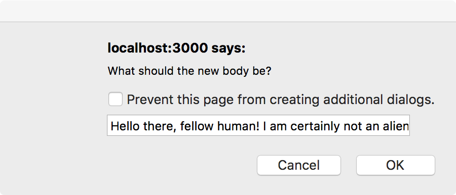

# You Do: Implement State (20 minutes) #

Let's implement state in our Blog by making `body` a mutable value.
> Remember to switch the running application!

1. Initialize a state using a `constructor()` method for our `Post` to set a initial state. It should create a state value called `body`. Set it to the `body` prop that's passed in to the component.
2. Modify `Post`'s `render` method so that `body` comes from `state`, not `props`.
3. Create a `changeBody` method inside `Post` that updates `body` based on a user input.
  - You should use `setState` somewhere in this method.
  - How can you get a user input? Keep it simple and start with `prompt`.
4. Add a button to `Post`'s `render` method that triggers `changeBody`.

## Solution

Your solution should look as follows:

### Bonus I ###

Use a form to take in user input.

- The post body should be updated using a method that is triggered by `onSubmit`.
- One option is to keep track of what the new input is going to be by triggering a method using `onChange` on the `< input >`
- Another option is to pass an event object to the `onSubmit` method and traverse the DOM from `e.target` to find the `< input >` value.

## Bonus Solution

Your solution should look as follows:

Solution code, including for using `onChange`, [here](https://git.generalassemb.ly/education-product/module-fe-framework-react/tree/master/projects/project-03-state).
